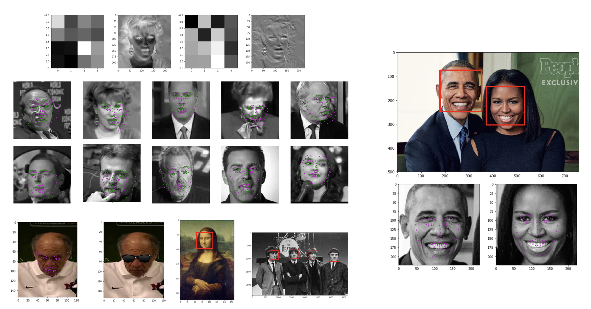

[](https://www.udacity.com/course/computer-vision-nanodegree--nd891)


# Facial Keypoint Detection

## Project Objective

In this project, I'll build a facial keypoint detection system that takes in any image with faces, recognizes and detects faces, and predicts the location of 68 distinguishing keypoints on each face!

__Background:__

_Facial keypoints_ include points around the eyes, nose, and mouth on a face and are used in many applications. These applications include: facial tracking, facial pose recognition, facial filters, and emotion recognition. 


## Getting the Files

### Data

All of the data you'll need to train a neural network should be placed in the subdirectory `data`. To get the data, run the following commands in your terminal:

```
mkdir data

wget -P data/ https://s3.amazonaws.com/video.udacity-data.com/topher/2018/May/5aea1b91_train-test-data/train-test-data.zip

unzip -n data/train-test-data.zip -d data
```

### Model Download

You can use my pre-trained model for your own experimentation. To use it, [download](https://www.dropbox.com/s/gk4j0ln3huqt93e/keypoints_model_1.pt?dl=0) the model and placed in the subdirectory `saved_models`.

## Result

Here are some visualizations of the facial recognition, keypoints detection, CNN feature maps, and interesting sunglasses layover applications:




## Dependencies

Before you can experiment with the code, you'll have to make sure that you have all the libraries and dependencies required to support this project. You will mainly need Python 3, PyTorch and its torchvision, OpenCV, Matplotlib, and tqdm.

